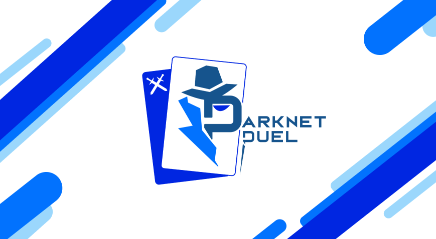

<h1 align="center">Darknet Duel</h1>

Darknet Duel is a multiplayer strategy game where players take on the roles of Attacker and Defender in a simulated cyber warfare environment. The project consists of a React-based frontend, a Node.js/Express backend API for authentication and persistence, and a dedicated game server using Boardgame.io for real-time game state management.

## Tech Stack

### Frontend (`darknet-duel-frontend`)
- **Framework:** React v19.1.0
- **Build Tool:** Vite v6.3.5
- **Language:** TypeScript ~5.8.3
- **Styling:** Tailwind CSS v3.4.1, DaisyUI v4.7.3
- **State Management:** Zustand v5.0.5
- **Routing:** React Router DOM v7.6.2
- **Real-time:** Socket.io Client v4.8.1

### Backend API (`backend-server`)
- **Runtime:** Node.js (node:20-alpine)
- **Framework:** Express v4.18.2
- **Language:** TypeScript v5.0.4
- **Database Driver:** MySQL2 v3.14.1
- **ORM:** TypeORM v0.3.16
- **Real-time:** Socket.io v4.8.1
- **Documentation:** Swagger UI Express v5.0.1

### Game Server (`game-server`)
- **Runtime:** Node.js (node:20-alpine)
- **Engine:** Boardgame.io v0.50.2
- **Server Framework:** Koa / Express
- **Real-time:** Socket.io v4.7.2

### Infrastructure
- **Database:** MySQL 8.0
- **Containerization:** Docker & Docker Compose
- **Proxy:** Nginx
- **CI/CD:** GitHub Actions

## Development

To run the entire stack in development mode, follow these steps:

1.  **Prerequisites:**
    -   Ensure **Node.js** (v20 or higher) is installed.
    -   Ensure **MySQL** is installed and running locally.

2.  **Database Setup:**
    -   Create a database named `darknet_duel` (or whatever you specify in your `.env`).

3.  **Configure Environment Variables:**
    The `backend-server`, `darknet-duel-frontend`, and `game-server` folders each contain a `.env.example` file.
    -   Rename `.env.example` to `.env` in each folder.
    -   Update the values in each `.env` file to match your local configuration.
    -   **Important:** Ensure the `backend-server` `.env` points to your local MySQL instance.

4.  **Initialize Database:**
    Run the initialization script to set up tables and default data:
    ```bash
    cd backend-server
    npm install
    npm run init-db
    ```

5.  **Install and Run:**
    Open three separate terminals and run the following commands in each folder:

    **Backend Server:**
    ```bash
    cd backend-server
    npm run dev
    ```

    **Game Server:**
    ```bash
    cd game-server
    npm install
    npm run dev
    ```

    **Frontend:**
    ```bash
    cd darknet-duel-frontend
    npm install
    npm run dev
    ```

6.  **Access the Application:**
    -   **Frontend:** `http://localhost:5173`
    -   **Backend API:** `http://localhost:8000`
    -   **Game Server:** `http://localhost:8001`
    -   **API Documentation:** `http://localhost:8000/api-docs`

## Deployment

### Self-Hosting

> **Note:** These instructions assume a **Linux environment** and that **Docker** and **Docker Compose** are already installed and running.

1.  **Clone the repository:**
    ```bash
    git clone <repository-url>
    cd darknet-duel
    ```

2.  **Configure Environment Variables:**
    Create a `.env` file in the root directory with the following content (adjust values as needed):

    ```env
    # Database
    MYSQL_ROOT_PASSWORD=secure_root_password
    DB_PASSWORD=secure_db_password
    
    # API Keys & Secrets
    JWT_SECRET=your_secure_jwt_secret
    SERVER_API_KEY=your_secure_server_api_key
    XENDIT_API_KEY=your_xendit_api_key
    
    # URLs (Adjust for your environment)
    FRONTEND_URL=http://localhost:8002
    BACKEND_URL=http://localhost:8000
    GAME_URL=http://localhost:8001
    
    # Ports (Optional overrides)
    # FRONTEND_PORT=8002
    # BACKEND_PORT=8000
    # GAME_PORT=8001
    ```

3.  **Run with Docker Compose:**
    ```bash
    docker-compose up -d
    ```

4.  **Access the Application:**
    -   Frontend: `http://localhost:8002` (or your configured `FRONTEND_PORT`)
    -   Backend API: `http://localhost:8000`
    -   Game Server: `http://localhost:8001`
    -   phpMyAdmin: `http://localhost:8003`

### GitHub Actions

The project includes a CI/CD pipeline defined in `.github/workflows/cicd.yml` that automatically builds and deploys the application.

> **Important:** The application will be deployed and run on the same machine where the self-hosted runner is installed.
>
> [**How to add a self-hosted runner**](https://docs.github.com/en/actions/hosting-your-own-runners/managing-self-hosted-runners/adding-self-hosted-runners)

-   **Triggers:** Pushes to `dev` and `main` branches, or manual workflow dispatch.

#### Setting up Secrets and Variables

> [**How to use secrets and variables in GitHub Actions**](https://docs.github.com/en/actions/security-for-github-actions/security-guides/using-secrets-in-github-actions)

-   **Environment Secrets Required:**
    -   `MYSQL_ROOT_PASSWORD`
    -   `DB_PASSWORD`
    -   `JWT_SECRET`
    -   `SERVER_API_KEY`
    -   `XENDIT_API_KEY`
    -   `GHCR_PAT` (GitHub Container Registry Personal Access Token)
-   **Environment Variables Required:**
    -   `FRONTEND_URL`
    -   `BACKEND_URL`
    -   `GAME_URL`
    -   `FRONTEND_PORT`
    -   `BACKEND_PORT`
    -   `GAME_PORT`
    -   `MYSQL_PORT`
    -   `PMA_PORT`

## Default Users

The system comes pre-configured with the following accounts for testing and administration:

| Role | Email | Password |
|------|-------|----------|
| **Administrator** | `admin@admin.com` | `Admin123!` |
| **Moderator** | `moderator@moderator.com` | `Moderator123!` |
| **Regular User** | `user@user.com` | `User123!` |
